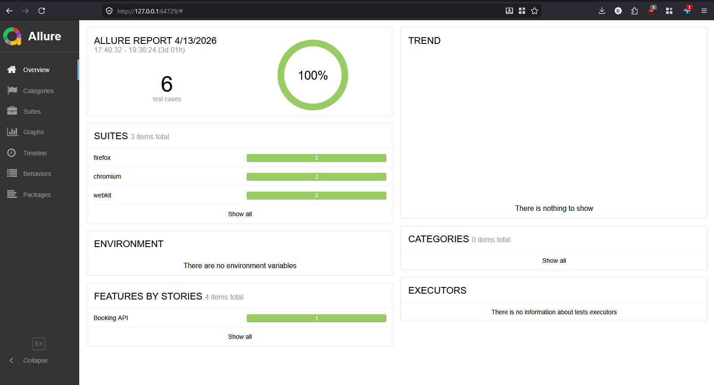
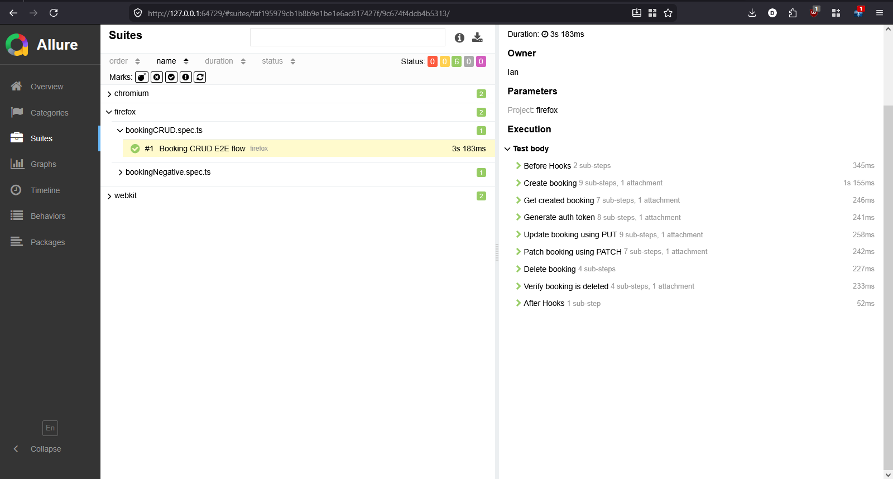
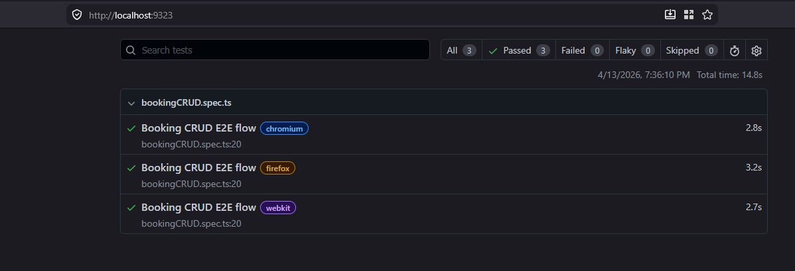
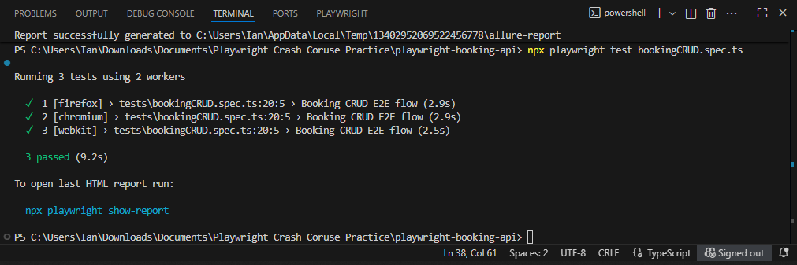

# Playwright API Automation – Booking CRUD

## Overview

API automation project using Playwright and TypeScript.
Implements a full CRUD (Create, Read, Update, Delete) workflow using:

https://restful-booker.herokuapp.com

This project demonstrates API testing, reusable helper functions, and proper validation practices.

---

## Tech Stack

* Playwright
* TypeScript
* Allure Report

---

## Project Structure

```
playwright-booking-api/
├── test-data/
│   ├── auth.json
│   ├── booking.json
│   ├── putBooking.json
│   └── patchBookingData.json
│
├── utils/
│   ├── apiHelpers.ts
│   └── allureHelpers.ts
│
├── tests/
│   └── booking/
│       ├── booking-crud-e2e.spec.ts
│       └── booking-negative.spec.ts
│
├── playwright.config.ts
├── package.json
```

---

## Setup

```bash
npm install
npx playwright install
npm install -D allure-playwright allure-commandline
```

---

## Run Tests

```bash
npx playwright test
```

---

## Reports

```bash
npx playwright show-report
npx allure serve allure-results
```

---

## Test Flow

1. Create Booking (POST)
2. Get Booking (GET)
3. Generate Token
4. Update Booking (PUT)
5. Patch Booking (PATCH)
6. Delete Booking (DELETE)
7. Verify Deletion (404)

---

## Validation Covered

* Status code validation
* Response body validation
* Nested JSON validation
* Updated vs unchanged fields (PATCH)
* Delete verification using GET (404)

---

## Negative Test

Update booking without token

Expected:

* 403 Forbidden

---

## Design Approach

* Uses `payload` for reusable API functions
* Avoids hardcoded test data
* Separates:

  * API logic (helpers)
  * test logic (spec files)
  * test data (JSON)

---

## Screenshots


```
## Screenshots





```

---

## Author

Ian Demillo
